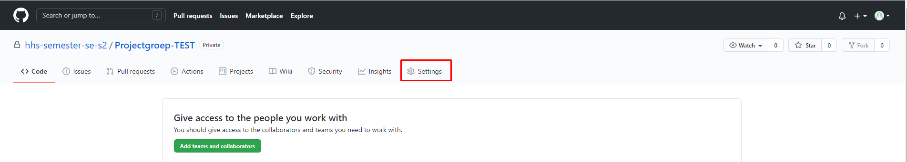
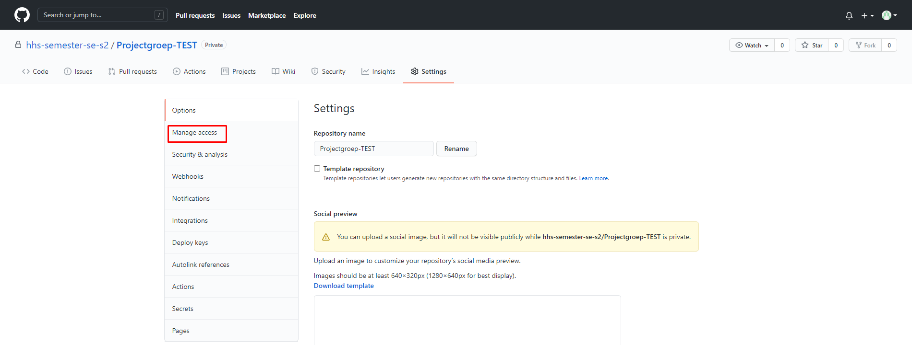
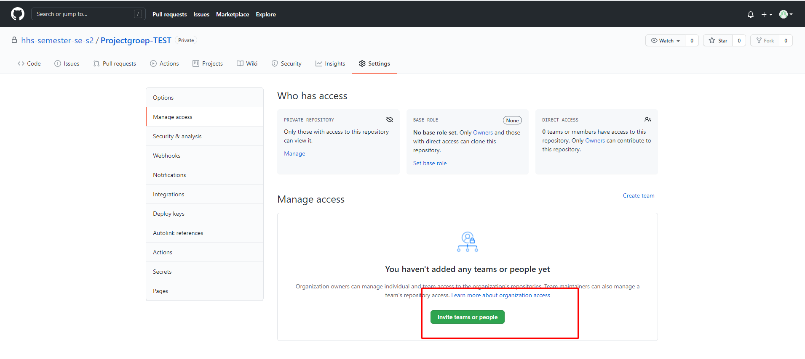
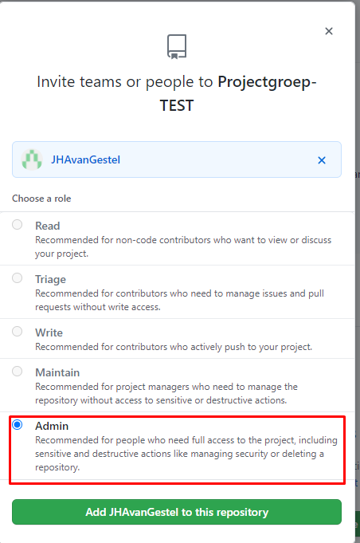

# Github

## Hoe voeg ik een groepsgenoot toe aan mijn repository?
Volg de onderstaande stappen:

- Navigeer naar github.com/hhs-semester-se-s2/Projectgroep-[X]  
Waar X staat vul je jouw groepsnaam in. Bijvoorbeeld '1a'.

- Klik op 'Settings'.

  

- Klik op 'Manage access'.

  

- Klik op 'Invite teams or people'.

  
- Vul de (Github) username van jouw groepsgenoot in.
    
  
- Geef jouw groepsgenoot vervolgens 'Admin' rechten en druk op 'Add X to this repository'

    
  
Hierna wordt er een uitnodiging gestuurd naar de persoon die zojuist toegevoegd is.    

Door deze uitnodiging te accepteren, maakt deze persoon direct deel uit van de repository.

