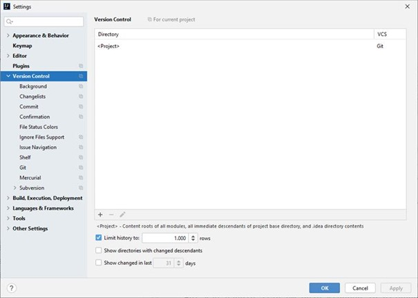
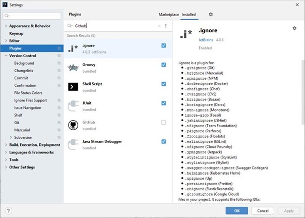
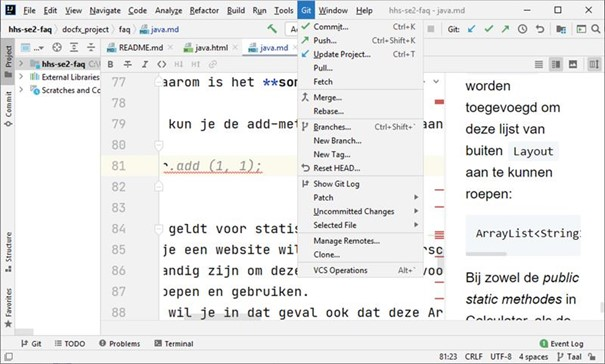
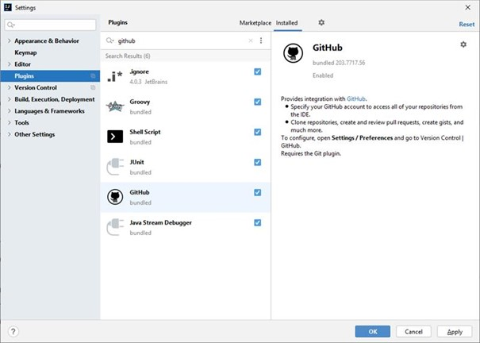
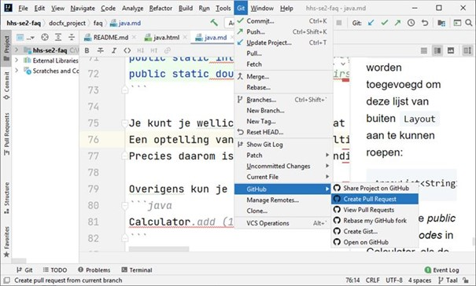

# IntelliJ

## "Ik heb problemen met mijn Github-plugin / kan geen GitHub-account toe voegen"

Als je met Ctrl-Alt-S 'Settings' hebt geopend en je onder het kopje 'Version Control' geen GitHub terug kunt vinden, is
de plugin voor GitHub niet geactiveerd of zelfs niet geinstalleerd. Controleer of je GitHub onder 'Version Control'
terug kunt vinden.

Als je onder 'Version Control' geen GitHub terug kunt vinden, ga je naar het kopje Plugins. Daar zou een vinkje moeten
staan voor de plugin 'GitHub' dat waarschijnlijk uit staat.
  

Deze plugin wordt standaard geïnstalleerd als je de Community Edition hebt geïnstalleerd.
Zoek in de plugins naar Github en controlleer of er een vinkje staat bij de plugin.
Indien dat niet het geval is, is consequentie hiervan o.a. dat je geen Pull Request kunt aanvragen via IntelliJ, want de menukeuze voor github ontbreekt.
(zoals je kunt zien in de screenshot hieronder)

Als je het vinkje aanzet en op Apply klikt, kun je accounts voor Github toevoegen en
kun je ook vanaf dat moment Pull Requests aanvragen:

